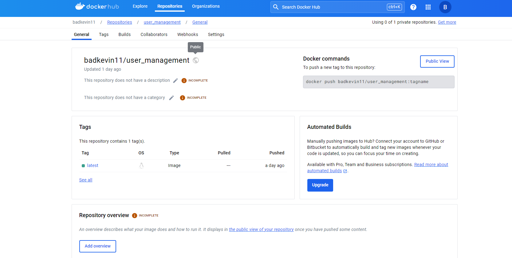

# Learning and Growth in REST API Development and Software Testing

## Introduction

As I progress in my journey as a software developer, delving deeper into the realm of REST API development has provided profound insights and tangible skill enhancements.

## REST API Mastery

REST APIs are fundamental to modern web interactions, allowing seamless connections between different software components. My journey through learning to create and manage these APIs has significantly improved how I approach building responsive and interactive applications.

## Documentation and Testing with Pytest

Documentation and testing are pillars of reliable software development. My experience with documenting APIs has taught me the importance of clarity and user-friendliness, ensuring that the APIs are not only functional but also accessible to other developers.

Using **pytest** has revolutionized my testing routines. It has equipped me with the tools to preemptively address potential failures, ensuring robustness and reliability before deployment.

## Real-World Problem Solving

Engaging directly with real-world problems has refined my problem-solving capabilities. Debugging, though challenging, has become a critical skill set, with each resolved issue boosting my confidence and expertise.

## Collaboration Enhances Understanding

Collaborating with peers has been invaluable, offering me perspectives on how different parts of a project fit and work together. This has not only honed my technical skills but also my abilities in communication and project management.

## Future Prospects

The knowledge and skills gained are foundational for my future career in API development and software testing. With a strong base established, I look forward to continued growth and new challenges in the tech industry.

## Conclusion

This learning experience has been pivotal, setting me up for advanced roles and responsibilities in software development. It underscores my commitment to continual learning and excellence in my professional journey.
